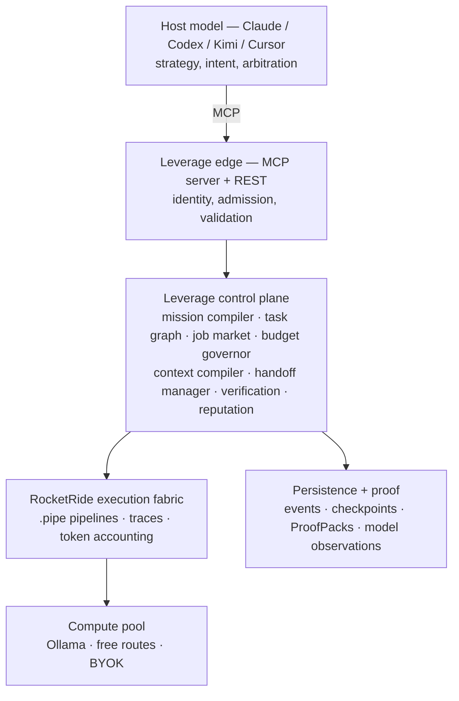
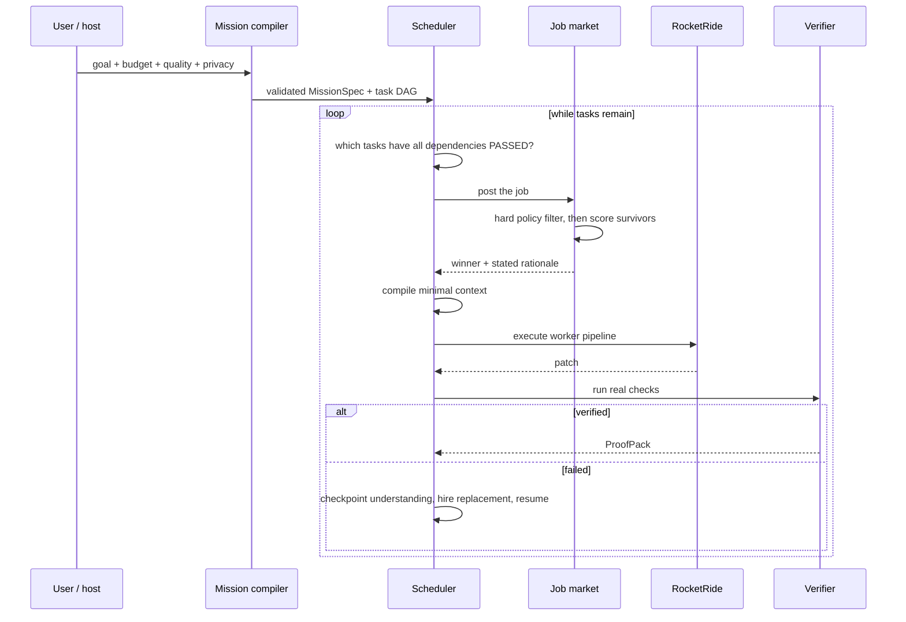

# Architecture

Leverage is an intelligence resource manager. Routing, fallback and delegation are
primitives it uses; none of them is the product. The product is the layer that decides
**what work exists, who should do it, what it may cost, and whether the output is true.**

---

## Four layers



The separation that matters:

| Layer | Owns |
|---|---|
| Host model | Strategy. Called once for intent, not for every unit of work. |
| Leverage | Decomposition, allocation, policy, context, verification, learning. |
| RocketRide | How a worker actually runs. |
| Compute pool | The models themselves. |

Leverage never re-implements RocketRide's pipeline execution, concurrency or tracing. It
sits above them.

---

## Module map

Domain code is dependency-free — no React, no database driver, no network client — so the
scheduler and budget governor are unit-testable without standing up infrastructure.

```
src/core/          the control plane, pure TypeScript
  types.ts         every contract in one place
  compiler.ts      natural language -> MissionSpec; planner output -> validated DAG
  dag.ts           cycle detection, readiness, legal state transitions
  auction.ts       the model job market
  policy.ts        hard eligibility filter (budget, privacy, capacity, health)
  budget.ts        reserve/settle ledger; the $0 invariant
  context.ts       minimal context bundle per task
  checkpoint.ts    cognitive checkpoint construction and rendering
  verify.ts        real command execution and the quality score
  reputation.ts    observations -> shrunk statistics
  scheduler.ts     the loop that ties them together
  faults.ts        deterministic fault injection at dispatch
  events.ts        append-only event log with redaction

src/providers/     model discovery, health, direct invocation
src/rocketride/    the execution fabric client and worker pipeline
src/server/        mission registry, tenancy
src/auth/          Privy verification (server-side), dev fallback
src/app/           Next.js routes, API and Mission Control
mcp/               the five-tool MCP server
```

---

## The loop



### Execution path is chosen by where the model lives

RocketRide's cloud engine cannot reach a runtime on the developer's machine. So:

- **cloud-reachable models** run inside a RocketRide pipeline;
- **local models** are invoked directly by the control plane.

Both are real execution. Only the fabric differs, and the auction is unaware of the
distinction — it picks a model, and the scheduler routes accordingly.

---

## Design decisions worth defending

### Policy runs before scoring

A paid model under a `$0` budget is not given a large negative weight. It is removed from
the pool and displayed struck out with the reason. If policy were a weight, a
sufficiently good score could buy past it.

### The budget reserves before it spends

Workers run concurrently. Without atomic reservation, four workers each check "is there
$0.05 left?" simultaneously and all four proceed. `BudgetGovernor.reserve()` claims
headroom first and `settle()` reconciles against real usage.

### Verification outranks confidence

Order of authority: compiler, tests, type system, static analysis, browser assertions,
then — last and smallest — an AI reviewer. A model saying `confidence: 0.98` contributes
nothing to the quality score on its own.

### Context is compiled, not dumped

A worker gets its writable file scope, read-only reference files (the tests it must
satisfy), the actual output of completed dependencies, and its own failure history.
Nothing else. The reduction is measured against a real walk of the repository, not
asserted.

> This was learned the hard way. The first implementation gave workers only their write
> scope, so every model was guessing the API contract of files it could not see. Adding
> read-only references and dependency outputs took the benchmark from 0/4 to 4/4.

### The handoff carries understanding, not transcript

A checkpoint holds the goal, the plan, decisions already made, files touched, checks
already passing, remaining work, and a hypothesis about why the last worker stopped. It
explicitly does **not** hold the conversation — if the handoff were as large as the
history it replaces there would be no saving to report. Both sizes travel with the
checkpoint so the percentage shown is arithmetic.

It also distinguishes cause. A rate limit says nothing about the approach, and the
successor is told so; a test failure hands over the failing assertion.

### Infrastructure failure is not the model's fault

A model that returns `INVALID_OUTPUT` or fails tests is barred from that task. A model
that hits a 429 or a timeout goes on a one-auction cooldown and can be hired again. Before
this distinction existed, one injected rate limit permanently benched the strongest
candidate and the task failed on weaker workers.

### The worker output protocol is fenced blocks, not JSON

Asking a model to embed a multi-line source file inside a JSON string requires it to escape
every newline, quote and backslash by hand. Small models fail constantly — the observed
failures were raw newlines and backtick template literals pasted into JSON strings. The
primary protocol is `### FILE: path` plus a fenced block, which needs no escaping. JSON is
still accepted, with a repair pass for exactly those two malformations.

### Reputation is shrunk

A model that went 1-for-1 is not a 100% model. Observed rates are pulled toward a neutral
prior with a pseudo-count, and a model with several observations and no successes is
penalised beyond what shrinkage alone would do. The UI leads with the sample count.

---

## Data model

Committed at `supabase/migrations/0001_init.sql`. Persistence sits behind a repository
interface with two implementations — an in-process store with JSON snapshots (current) and
a server-only Supabase client (when credentials exist). Nothing above `src/server/` changes
between them.

---

## What is not built

Stated plainly rather than implied:

- Privy and Supabase are not wired — see BLOCKERS_REQUIRING_HUMAN.md.
- Multi-process crash recovery persists completed missions but does not resume an
  interrupted one.
- Model tournaments and the approval workflow are specified in the domain types but the
  scheduler does not yet run them.
