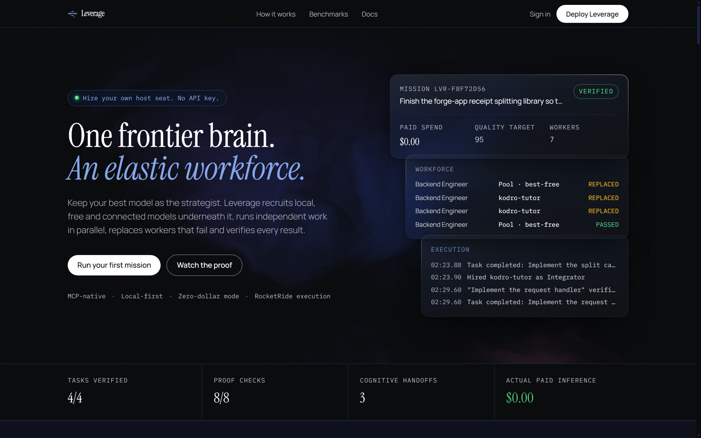
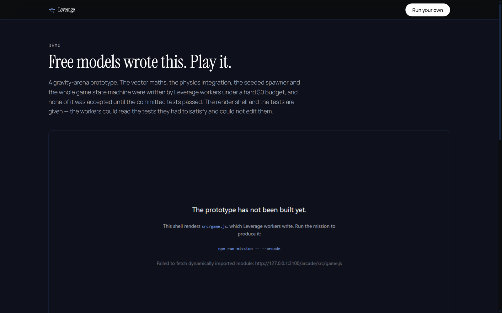
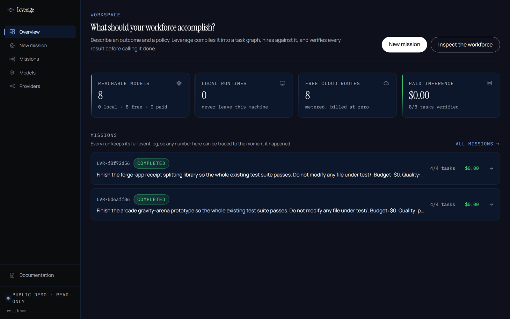
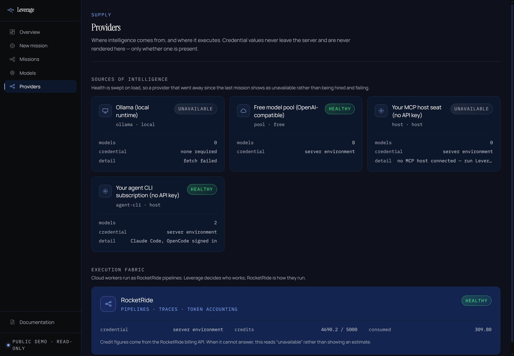

# Leverage

**One frontier brain. An elastic workforce.**

> Your best model should make the expensive decisions. It should not write the fortieth test.

[](https://useleverage.vercel.app)
[](tests/invariants.test.ts)
[](demo/canonical-run.json)
[](docs/ROCKETRIDE_FINDINGS.md)

**Live: https://useleverage.vercel.app** — a read-only public demo, seeded with the
runs that actually happened. Every mutating route answers `403`; executing a mission
needs a local repository to write into and a local model pool to hire from.



Leverage gives Claude, Codex and other MCP hosts a dynamic workforce of local, free and
connected models, then verifies the work and replaces workers that fail.

Your best model should decide the architecture. It should not spend the same premium
compute writing the fortieth boilerplate test.

---

## What it actually does

You state an outcome and a policy:

```
Finish this application and make the test suite pass.
Budget: $0.  Quality: production.  Privacy: prefer local.
```

Leverage compiles that into a task graph, discovers every model it can reach, scores them
against each task, hires the best *eligible* one, gives it the smallest context that can do
the job, executes it as a RocketRide pipeline, and refuses to call the task done until a
compiler or a test runner says so. When a worker dies it keeps the worker's understanding
and hands it to a replacement.

### The cognitive handoff, replayed from the real event log



*A worker hits a provider limit. Leverage checkpoints what it understood, hires a
replacement, and the work resumes instead of restarting.*

## See it produce something

`/demo` embeds a playable gravity-arena prototype whose entire logic — vector maths,
physics integration, seeded spawner, game state machine — was written by Leverage
workers under a hard `$0` budget. The tests and the render shell are given; the workers
could read the tests they had to satisfy and could not edit them.

| Arcade run `LVR-5d6aff86` | |
|---|---|
| Tasks verified | 4 / 4 |
| Proof checks | 8 / 8 |
| Logic suite | 22 / 22, `exit 0` |
| Workers | 6, across host · free · local |
| Cognitive handoffs | 2 (62% and 84% context reduction) |
| **Actual paid inference** | **$0.00** |

```bash
npm run fixture:reset:arcade
npm run mission -- --arcade
cd benchmark/arcade && npm test
```

### Mission Control



### Connected compute



*Local runtimes, free routes, your MCP host seat, and your agent-CLI subscription.
Credential values never leave the server and are never rendered.*

## The run this repository ships with

A real recorded mission, not a mock — `LVR-f8f72d56`, in `demo/canonical-run.json`:

| | |
|---|---|
| Tasks | 4 / 4 verified |
| Proof checks | 8 / 8 pass |
| Full suite | 17 / 17 tests, `exit 0` |
| Workers hired | 7 |
| Cognitive handoffs | 3 (one injected 429, two genuine test failures) |
| Context reduction at handoff | 57%, 48%, 30% — measured |
| **Actual paid inference** | **$0.00** |

Reproduce it:

```bash
npm run fixture:reset
npm run mission -- --inject-429 --out=demo/canonical-run.json
```

## Quickstart

```bash
npm install
cp .env.example .env.local          # fill in ROCKETRIDE_APIKEY
npm run probe:models                # measure what your models can actually do
npm run mission                     # run the benchmark mission for real
npm run dev                         # Mission Control at http://localhost:3000
```

You need at least one source of intelligence. In order of "least setup":

| Source | Setup | Key needed |
|---|---|---|
| **Your agent CLI** | already installed and logged in (`claude`, `codex`, `gemini`, `opencode`) | none |
| **Your MCP host seat** | run Leverage as an MCP server inside Claude Code / Codex / Cursor | none |
| **Ollama** | `ollama pull qwen2.5-coder:3b` | none |
| **Any OpenAI-compatible endpoint** | set `OMNIROUTE_BASE_URL` | yours |

plus a RocketRide staging key for the execution fabric.

## Using the subscription you already pay for

Two routes, neither of which asks for an API key:

**1. Your installed agent CLI.** Claude Code, Codex and friends ship a headless mode
(`claude -p`, `codex exec`) that authenticates with the login you already performed.
Leverage detects them on `PATH`, probes whether they are signed in, and hires them as
workers. Some of them report real token usage and cost back, so the ledger gets measured
numbers rather than estimates.

**2. MCP sampling.** When Leverage runs as an MCP server inside your agent, it can call
`sampling/createMessage` back through the protocol and get a completion from the model
your host is already signed in to.

Both land in the `host` cost class: counted separately from free routes, never charged,
and eligible inside Zero-Dollar Mode because your subscription already paid.

**What Leverage will not do:** drive a logged-in browser session to borrow a consumer
subscription. ChatGPT Plus and Claude Pro have no API, and anything that claims to
"connect" one is automating a web UI against its terms with your credentials. The two
routes above get you the same model, legitimately, and Leverage never handles a password
or a token.

## Use it from your host

```bash
claude mcp add leverage -- node /abs/path/to/leverage/mcp/server.ts
```

Then, inside the host:

> Use Leverage. Finish this application. Budget $0. Quality production.

Five tools: `leverage_run`, `leverage_status`, `leverage_cancel`, `leverage_proof`,
`leverage_models`. `leverage_run` returns a mission id immediately — a mission takes
minutes and holding a synchronous MCP call open for that long would be unusable.

## Zero-Dollar Mode

When the budget is zero, zero means zero. It is not a preference the scheduler weighs:

- The **policy filter runs before scoring**, so a paid model at `$0` never enters the
  ranking pool at all. Mission Control shows it struck out with the reason.
- The **budget governor** reserves headroom atomically before any paid call, so four
  concurrent workers cannot each check the balance and all proceed.
- Both are asserted in `tests/invariants.test.ts`, including the concurrency case.

## Proof-carrying work

A task is complete when a compiler, a test runner or the filesystem says so. Every
completion carries a ProofPack: the checks that ran, what they returned, files changed,
a quality breakdown and the real spend. Model self-confidence is recorded separately and
is the smallest term in the score.

## How it is put together

```
Host model (Claude / Codex / Kimi)   strategy
        |  MCP
Leverage control plane               what work exists, who does it, what it may cost,
                                     whether the output is true
        |
RocketRide                           execution fabric: pipelines, traces, token accounting
        |
Ollama / free routes / BYOK          the compute pool
```

Full detail in [ARCHITECTURE.md](ARCHITECTURE.md). The RocketRide integration has three
places where the published docs disagree with the running system —
[docs/ROCKETRIDE_FINDINGS.md](docs/ROCKETRIDE_FINDINGS.md) records what is actually true.

## Verify it yourself

```bash
npm run verify              # typecheck, lint, 53 invariant tests, production build
npm run verify:rocketride   # real inference through a real pipeline, real credit delta
```

## Documentation

| | |
|---|---|
| [JUDGE_GUIDE.md](JUDGE_GUIDE.md) | Three minutes, in order |
| [ARCHITECTURE.md](ARCHITECTURE.md) | The four layers and why they are separate |
| [SECURITY.md](SECURITY.md) | Threat model, secrets, tenancy, prompt injection |
| [BENCHMARKS.md](BENCHMARKS.md) | Methodology, and what the numbers do not mean |
| [DESIGN.md](DESIGN.md) | The visual system, shared by app, site and film |
| [docs/ROCKETRIDE_FINDINGS.md](docs/ROCKETRIDE_FINDINGS.md) | What the RocketRide docs get wrong |
| [BLOCKERS_REQUIRING_HUMAN.md](BLOCKERS_REQUIRING_HUMAN.md) | What still needs a human |

## Licence

MIT.
