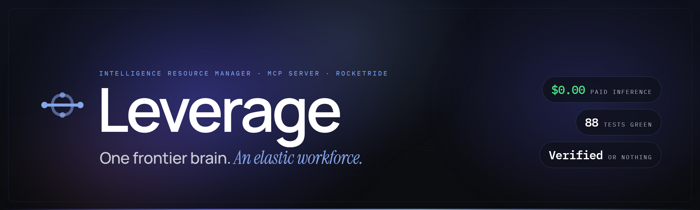
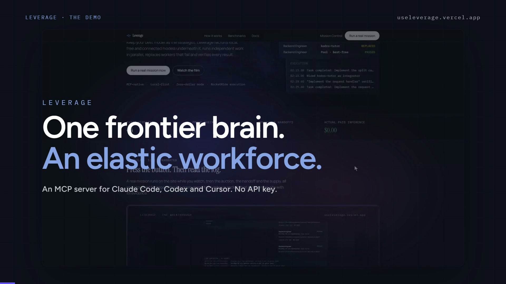
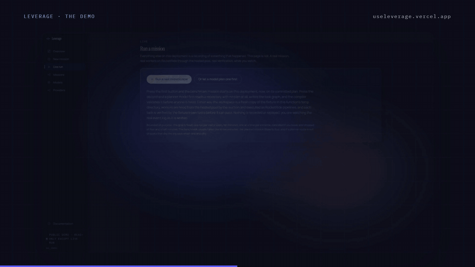
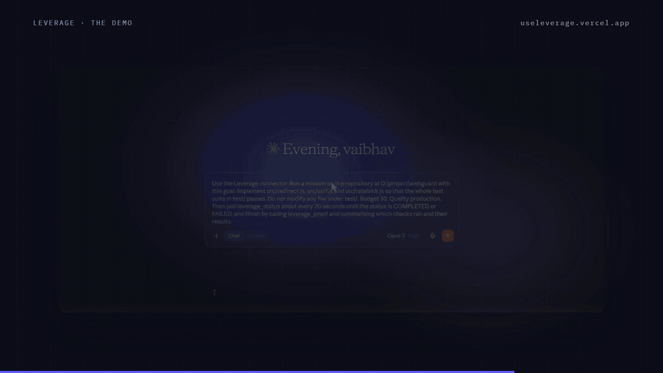

<p align="center">
  
</p>

<h1 align="center">Leverage</h1>

<p align="center">
  <a href="https://useleverage.vercel.app">Live site</a> · <a href="https://youtu.be/TQJ_neL7gFY">Demo film</a> · <a href="docs/TECHNICAL_REPORT.md">Technical report</a> · <a href="ARCHITECTURE.md">Architecture</a> · <a href="JUDGE_GUIDE.md">Judge guide</a>
</p>

<p align="center">
  <a href="https://useleverage.vercel.app"></a>
  <a href="https://youtu.be/TQJ_neL7gFY"></a>
  <a href="https://github.com/vaibhav4046/leverage/actions/workflows/ci.yml"></a>
  <a href="tests/invariants.test.ts"></a>
  <a href="demo/canonical-run.json"></a>
  <a href="docs/ROCKETRIDE_FINDINGS.md"></a>
  <a href="LICENSE"></a>
</p>

**The intelligence resource manager under the model you already pay for.** Your best model keeps the strategy. Leverage is the MCP server underneath it: five tools that recruit local, free and subscription models, give each one the smallest job it can verify, execute cloud-class workers as RocketRide pipelines, and refuse to call anything done until the repository's own tests say so. When a worker fails, its understanding is checkpointed and handed to a replacement, so the work continues instead of restarting.

> Your best model should make the expensive decisions. It should not write the fortieth test.

## Watch it work

<p align="center">
  <a href="https://youtu.be/TQJ_neL7gFY"></a>
</p>

*2:22. What Leverage is, what it is for, the harness, a real mission running on the live site, and the same product driven from a Claude chat through its connector. Every frame inside a window is a real session.*

<table>
<tr>
<td width="50%"></td>
<td width="50%"></td>
</tr>
<tr>
<td><i>Press one button on the live site: a planner writes the task graph, workers are hired, every task passes its own tests, the whole suite runs green. $0.00 paid.</i></td>
<td><i>One Claude message on a real repository: planned in 45.7 s, 3 tasks, 2 real handoffs from checkpoints, whole suite green, proof back in the chat.</i></td>
</tr>
</table>

## What it does

| | |
|---|---|
| **Plans from the repository** | Point it at a repository and a planner model writes the task graph. The compiler refuses cycles, escaping paths and any task no test can prove. |
| **Auctions every reachable model** | Each task is scored on fit, verified track record, context fit, availability, cost and privacy. The winner's rationale is written into the log; the losers are struck out with a reason. |
| **Zero means zero** | With a $0 budget the policy filter runs before scoring, so a paid route never enters the auction. Not outranked. Removed. |
| **Verified or nothing** | A task is done when `node --test`, `npm test` or `vitest` exits 0. The failure excerpt quotes the assertion. After the last task, the whole suite runs once more. |
| **Cognitive handoff** | A 429, a timeout, an invalid output or a red test releases the worker, checkpoints what it understood, and resumes the task on a replacement. Context reduction at handoff is measured. |
| **Proof-carrying work** | Every completion carries the checks that ran, the files changed, a patch hash, quality as the pass rate of what actually ran, and the real spend. |
| **Lives where you work** | Five MCP tools over stdio for Claude Code, Codex and Cursor, and over Streamable HTTP for chat connectors. |
| **Runs on RocketRide** | Cloud-class workers execute as `webhook → llm_openai_api → response` pipelines on staging, through a token-gated pool. Credits are read from billing before and after. |

## Quick install

```bash
git clone https://github.com/vaibhav4046/leverage && cd leverage
npm install
cp .env.example .env.local          # LEVERAGE_DEV_AUTH=1 is preset so a local checkout can run missions
npm run dev                         # Mission Control at http://localhost:3000
```

You need at least one source of intelligence. In order of least setup:

| Source | Setup | Key needed |
|---|---|---|
| **Your agent CLI** | already installed and logged in (`claude`, `codex`, `gemini`, `opencode`) | none |
| **Your MCP host seat** | run Leverage as an MCP server inside Claude Code / Codex / Cursor | none |
| **Ollama** | `ollama pull qwen2.5-coder:3b` | none |
| **Any OpenAI-compatible endpoint** | set `OMNIROUTE_BASE_URL` | yours |
| **The hosted pool** | your deployment's `/api/v1/pool` with `POOL_UPSTREAMS`, `POOL_KEY_*`, `POOL_MODELS`, `POOL_ACCESS_TOKEN` (see `.env.example`); `node scripts/pool-sweep.mjs` tells you which models actually answer | free-tier keys work |

A RocketRide key is optional on your machine: with `ROCKETRIDE_APIKEY` set, cloud-class workers run as RocketRide pipelines; without it they are called directly and the mission log says so.

## Getting started

**From your host.** Add the server, then talk to it:

```bash
claude mcp add leverage -- node /abs/path/to/leverage/mcp/server.ts
```

> Use Leverage. Finish this application. Budget $0. Quality production.

**From a chat application.** The same five tools over Streamable HTTP, for a claude.ai custom connector or any client behind a tunnel:

```bash
npm run mcp:http                                  # http://127.0.0.1:3200/mcp, stateless
cloudflared tunnel --url http://127.0.0.1:3200    # then add https://<host>/mcp as a connector
```

> Use the Leverage connector. Run a mission on the repository at D:\project\webguard with this goal: implement src/redirect.js, src/ssrf.js and src/ratelimit.js so that the whole test suite in test/ passes. Budget $0. Quality production. Poll leverage_status until it is COMPLETED or FAILED, then call leverage_proof.

**From the command line.**

```bash
npm run probe:models                # measure what your models can actually do
npm run mission                     # the benchmark mission, for real, on the bundled fixture
npm run mission -- --repo=/abs/path/to/your/repo --goal="make test/ pass"   # your repository, planned by a model
```

Five tools: `leverage_run`, `leverage_status`, `leverage_cancel`, `leverage_proof`, `leverage_models`. `leverage_run` returns a mission id immediately, because a mission takes minutes and a synchronous MCP call held open that long would be unusable.

## The evidence

Every mission below is in the repository or on film. None is a mock.

| Mission | What it proves | Result |
|---|---|---|
| `LVR-f8f72d56` · [`demo/canonical-run.json`](demo/canonical-run.json) | the full loop with an injected 429 | 4/4 tasks, 8/8 checks, suite 17/17, 7 workers, 3 handoffs, context cut 57%, 48%, 30%, **$0.00** |
| `LVR-5d6aff86` · [`demo/arcade-run.json`](demo/arcade-run.json) | a playable game's logic written by workers under a hard $0 budget | 4/4 tasks, 8/8 checks, suite 22/22, 2 handoffs, **$0.00** |
| `LVR-31eacf88` · [`demo/planned-run.json`](demo/planned-run.json) | a plan written by a model, not a committed one | whole suite green, 24.6 RocketRide credits, output at `demo/output/greeter` with a matching patch hash |
| `LVR-2d4d56e0` · [`demo/evidence/`](demo/evidence/) | the live page's second button, planned inside the deployment | verified in 121 s, 15.8 credits, transcript recorded |
| `LVR-e6443739` · [the film](https://youtu.be/TQJ_neL7gFY) | driven from a Claude chat on a real repository | planned in 45.7 s, 3 tasks, 2 handoffs, whole suite green, quality 100, **$0.00** |

Reproduce the first one:

```bash
npm run fixture:reset
npm run mission -- --inject-429 --out=demo/canonical-run.json
cd benchmark/forge-app && node --test      # 17 tests, 29 assertions
```

### Mission Control

<p align="center"></p>

*The plan as the model wrote it. Each candidate's utility and the winner's reasoning. An append-only log with filters. A proof pack with every check and its result, the whole-suite run included.*

<p align="center"></p>

*A worker hits a provider limit. Leverage checkpoints what it understood, hires a replacement, and the work resumes instead of restarting.*

### See it produce something

[`/demo`](https://useleverage.vercel.app/demo) embeds a playable gravity-arena prototype whose entire logic (vector maths, physics integration, seeded spawner, game state machine) was written by Leverage workers under a hard `$0` budget. The tests and the render shell were given; the workers could read the tests they had to satisfy and could not edit them.

```bash
npm run fixture:reset:arcade
npm run mission -- --arcade
cd benchmark/arcade && npm test
```

## How it is put together

```
Host model (Claude / Codex / Cursor)   strategy
        |  MCP (stdio or Streamable HTTP)
Leverage control plane                 what work exists, who does it, what it may cost,
                                       whether the output is true
        |
RocketRide                             execution fabric: pipelines, traces, token accounting
        |
Ollama / free routes / your own seat   the compute pool
```

The loop: **compile** the goal into a validated task graph, **auction** every reachable model per task, **hire** the best eligible one, **execute** as a RocketRide pipeline, **verify** with the repository's own tests, **prove** with a proof pack, and on failure **hand off** from a checkpoint. Full detail in [ARCHITECTURE.md](ARCHITECTURE.md); the reasoning behind each design decision is in the [technical report](docs/TECHNICAL_REPORT.md).

### Using the subscription you already pay for

Two routes, neither of which asks for an API key. **Your installed agent CLI**: Claude Code, Codex and friends ship a headless mode that authenticates with the login you already performed; Leverage detects them on `PATH`, probes whether they are signed in, and hires them as workers. **MCP sampling**: as an MCP server inside your agent, Leverage can call `sampling/createMessage` back through the protocol. Both land in the `host` cost class: never charged, eligible under a zero budget because your subscription already paid.

What Leverage will not do: drive a logged-in browser session to borrow a consumer subscription. The two routes above get you the same model legitimately, and Leverage never handles a password or a token.

### Zero-Dollar Mode

When the budget is zero, zero means zero. The policy filter runs before scoring, so a paid model never enters the ranking pool; Mission Control shows it struck out with the reason. The budget governor reserves headroom atomically before any paid call, so four concurrent workers cannot each check the balance and all proceed. Both are asserted in [`tests/invariants.test.ts`](tests/invariants.test.ts), including the concurrency case.

## Verify it yourself

```bash
npm run verify              # typecheck, lint, 95 tests (invariants, pool guards, planner, verification, process control), production build
npm run verify:rocketride   # real inference through a real pipeline, real credit delta
```

CI runs the same commands on every push. The site was audited at 40 viewport and console combinations (all clean) and with axe on 12 pages (0 violations).

## RocketRide, as it actually behaves

The published docs disagree with the running engine in three places, and one wiring mistake produces a pipeline that runs, reports no errors, consumes credits and never invokes the model. [docs/ROCKETRIDE_FINDINGS.md](docs/ROCKETRIDE_FINDINGS.md) records what is true, verified by execution, with the measured cost per run.

## Documentation

| | |
|---|---|
| [docs/TECHNICAL_REPORT.md](docs/TECHNICAL_REPORT.md) | The harness, the recorded missions, verification, evaluation |
| [JUDGE_GUIDE.md](JUDGE_GUIDE.md) | Three minutes, in order |
| [ARCHITECTURE.md](ARCHITECTURE.md) | The four layers and why they are separate |
| [SECURITY.md](SECURITY.md) | Threat model, secrets, tenancy, prompt injection |
| [BENCHMARKS.md](BENCHMARKS.md) | Methodology, and what the numbers do not mean |
| [DESIGN.md](DESIGN.md) | The visual system, shared by app, site and film |
| [docs/ROCKETRIDE_FINDINGS.md](docs/ROCKETRIDE_FINDINGS.md) | What the RocketRide docs get wrong |
| [docs/EXECUTION_LEDGER.md](docs/EXECUTION_LEDGER.md) | What was executed, when, and what it cost |
| [docs/supademo/](docs/supademo/) | Stills and the step script for the interactive demo |
| [CONTRIBUTING.md](CONTRIBUTING.md) | How to change it without breaking its standard |

## Contributing

```bash
npm install && npm run verify
```

A change to scheduling, verification, policy or the proof pack comes with a test. Failures stay loud. No number without a source. See [CONTRIBUTING.md](CONTRIBUTING.md).

## Built for the RocketRide x SCU Buildathon

Solo, by [Vaibhav Lalwani](https://github.com/vaibhav4046), September 2026. Questions and showcase in the [RocketRide Discord](https://discord.gg/PMXrtenMsY).

## Licence

MIT.
